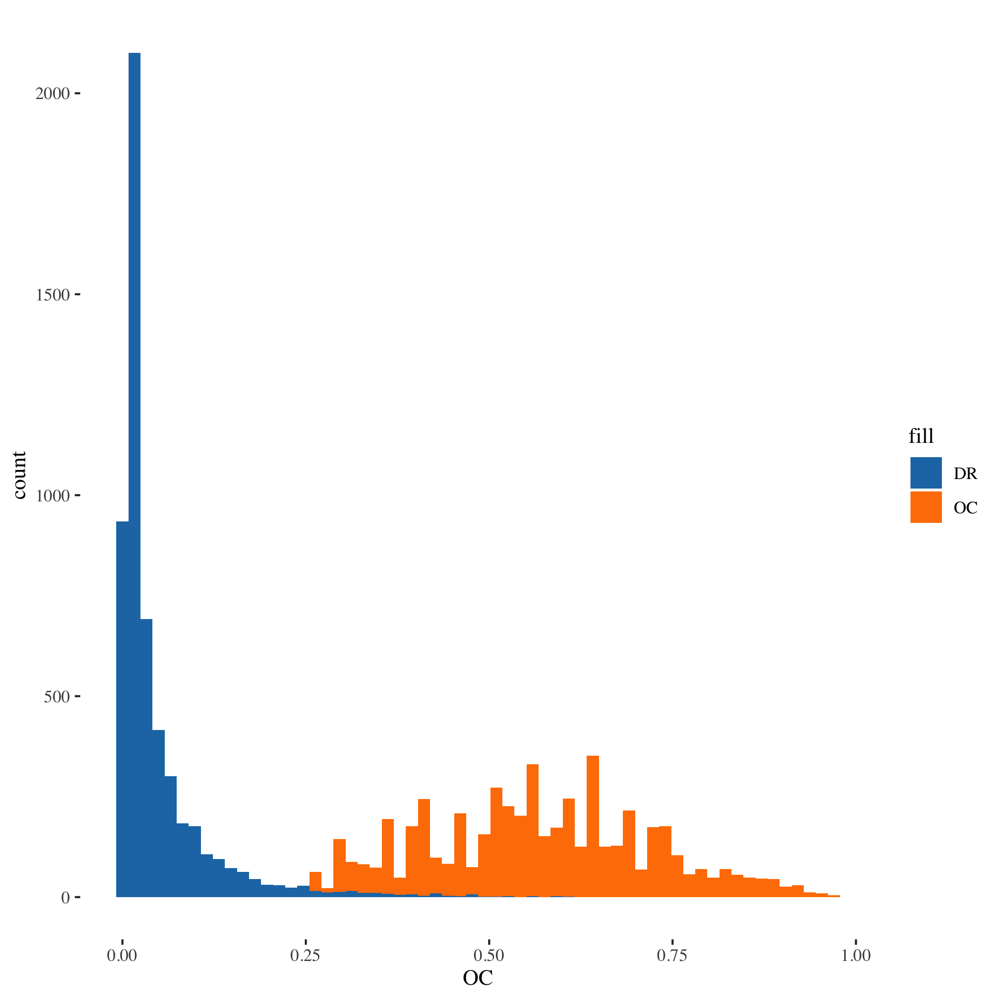
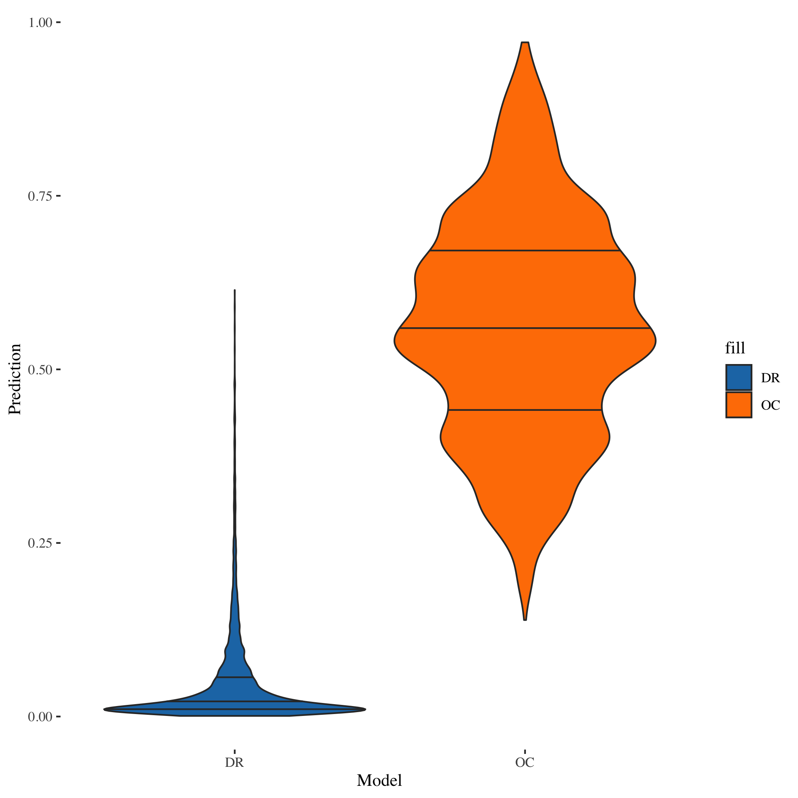
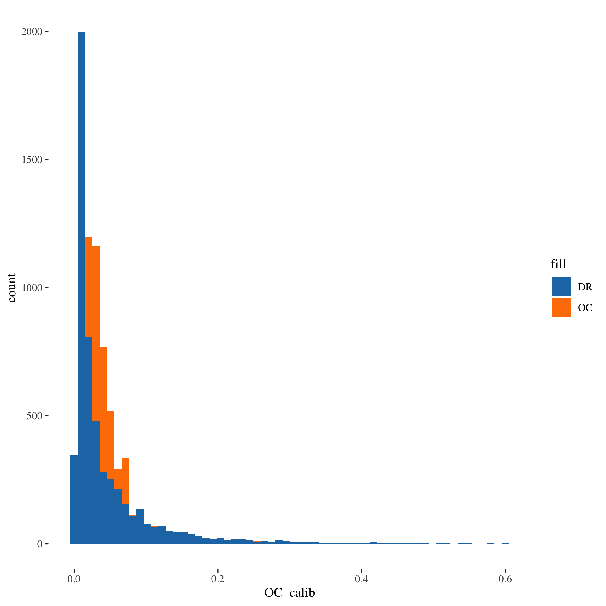
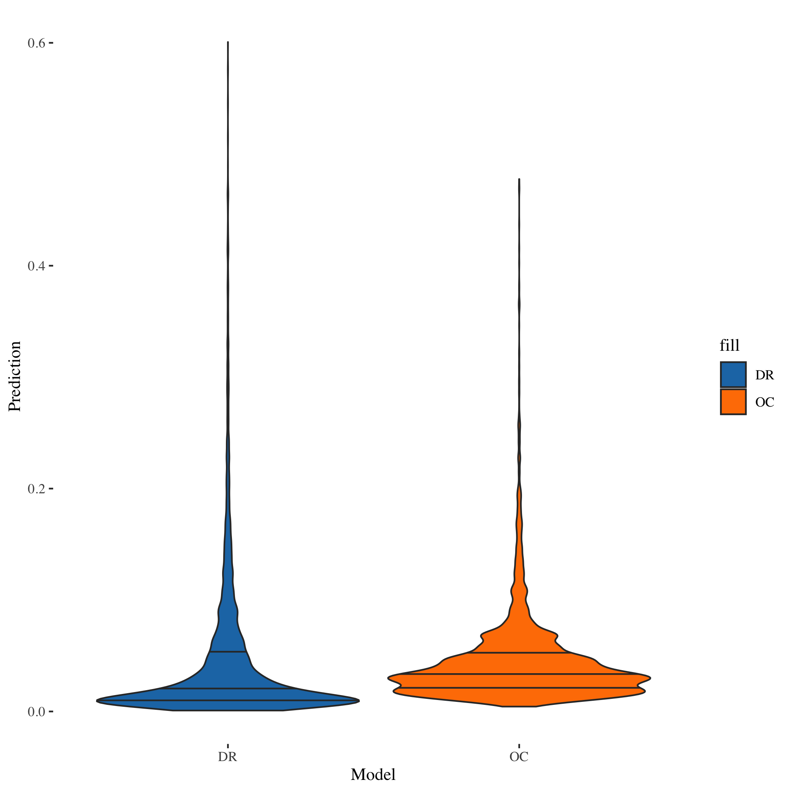

## Load data and look at the results

First, let’s load the data with the predictions from the original,
external model, and datarobot models:

    library(data.table)
    data <- fread('~/workspace/data-science-scripts/zach/external_vs_dr/custom_vs_dr_vs_actuals.csv')
    setnames(
      data,
      c('Real Prediction', 'OC prediction', 'DR Prediction'),
      c('target', 'OC', 'DR')
    )
    data[,target := as.integer(target)]

Now, let’s take a look at the predictions from OC vs DataRobot. The 2
distributions are very different, which makes these models hard to
compare.

    summary(data)

    ##      target              OC               DR          
    ##  Min.   :0.00000   Min.   :0.1390   Min.   :0.000903  
    ##  1st Qu.:0.00000   1st Qu.:0.4470   1st Qu.:0.009793  
    ##  Median :0.00000   Median :0.5580   Median :0.020185  
    ##  Mean   :0.04493   Mean   :0.5605   Mean   :0.047158  
    ##  3rd Qu.:0.00000   3rd Qu.:0.6710   3rd Qu.:0.054511  
    ##  Max.   :1.00000   Max.   :0.9710   Max.   :0.614225

The mean of the target is 0.045. The DataRobot model has a mean
prediction of 0.047, while the OC model has a mean prediction of 0.56.

The DataRobot model appears to be well-calibrated, but the OC model does
not.

This calibration problem for the OC model has a huge impact on it’s
logloss:

    data[,list(
      OC_logloss=logLoss(target, OC),
      DR_logloss=logLoss(target, DR),
      baseline_logloss=logLoss(target, rep(mean(target), .N))
    )]

    ##    OC_logloss DR_logloss baseline_logloss
    ## 1:  0.8730497  0.1444751        0.1832989

The accuracy of the OC model is 6.04 times worse that the DataRobot
model! Even worse, it’s 4.76 times worse than the baseline model (which
is the mean of the target).

Clearly, the OC model can’t be trusted or compared to the DataRobot
model.

    library(ggplot2)
    library(ggthemes)
    ggplot(data, aes()) + 
      geom_histogram(aes(x=OC, fill='OC'), bins=60) + 
      geom_histogram(aes(x=DR, fill='DR'), bins=60) + 
      scale_fill_manual(values = c("#1F78B4", "#FF7F00")) + 
      theme_tufte()

    ggplot(data, aes()) + 
      geom_violin(aes(x='OC', y=OC, fill='OC'), draw_quantiles = c(0.25, 0.5, 0.75)) + 
      geom_violin(aes(x='DR', y=DR, fill='DR'), draw_quantiles = c(0.25, 0.5, 0.75)) + 
      scale_fill_manual(values = c("#1F78B4", "#FF7F00")) + 
      xlab('Model') + 
      ylab('Prediction') + 
      theme_tufte()

## Re-calibrate external model

Let’s define a simple calibration function to adjust the predictions
from these models:

    recalibrate <- function(x, y=data[['target']]){

      # First, convert from the logit scale to the linear scale
      x_inv <- qlogis(x)
      
      # Now use logist regression to find the itnercewpt that makes x's mean match y's mean
      model <- glm(y ~ 1, offset=x_inv, family='binomial')
      intercept <- coef(model)[1]

      # Now add the intercept and convert back to the logit scale
      x_calib <- plogis(x_inv + intercept)
      return(x_calib)
    }

We apply this function to both OC and DR to make sure the comparison of
the 2 models is fair. The DR model doesn’t need much calibration:

    data[,OC_calib := recalibrate(OC)]
    data[,DR_calib := recalibrate(DR)]

## Compare the 2 models

Now that we’ve calibrated the data, the OC model and the DR model both
predict the correct mean:

    summary(data)

    ##      target              OC               DR              OC_calib       
    ##  Min.   :0.00000   Min.   :0.1390   Min.   :0.000903   Min.   :0.004391  
    ##  1st Qu.:0.00000   1st Qu.:0.4470   1st Qu.:0.009793   1st Qu.:0.021607  
    ##  Median :0.00000   Median :0.5580   Median :0.020185   Median :0.033342  
    ##  Mean   :0.04493   Mean   :0.5605   Mean   :0.047158   Mean   :0.044927  
    ##  3rd Qu.:0.00000   3rd Qu.:0.6710   3rd Qu.:0.054511   3rd Qu.:0.052781  
    ##  Max.   :1.00000   Max.   :0.9710   Max.   :0.614225   Max.   :0.477752  
    ##     DR_calib        
    ##  Min.   :0.0008532  
    ##  1st Qu.:0.0092581  
    ##  Median :0.0190937  
    ##  Mean   :0.0449273  
    ##  3rd Qu.:0.0516621  
    ##  Max.   :0.6007075

Now that both models are calibrated, let’s take a look at their logloss:

    data[,list(
      OC_logloss=logLoss(target, OC_calib),
      DR_logloss=logLoss(target, DR_calib),
      baseline_logloss=logLoss(target, rep(mean(target), .N))
    )]

    ##    OC_logloss DR_logloss baseline_logloss
    ## 1:  0.1767135  0.1444123        0.1832989

The accuracy of the OC model is still 1.22 times worse that the
DataRobot model. It’s very slightly better than the baseline model, but
even with calibration it is clear that the DataRobot models is more
accurate.

    library(ggplot2)
    library(ggthemes)
    ggplot(data, aes()) + 
      geom_histogram(aes(x=OC_calib, fill='OC'), bins=60) + 
      geom_histogram(aes(x=DR_calib, fill='DR'), bins=60) + 
      scale_fill_manual(values = c("#1F78B4", "#FF7F00")) + 
      theme_tufte()

    ggplot(data, aes()) + 
      geom_violin(aes(x='OC', y=OC_calib, fill='OC'), draw_quantiles = c(0.25, 0.5, 0.75)) + 
      geom_violin(aes(x='DR', y=DR_calib, fill='DR'), draw_quantiles = c(0.25, 0.5, 0.75)) + 
      scale_fill_manual(values = c("#1F78B4", "#FF7F00")) + 
      xlab('Model') + 
      ylab('Prediction') + 
      theme_tufte()

The OC model is still tending to predict higher than the DR model, but
the prediction distributions are now much more similar.
